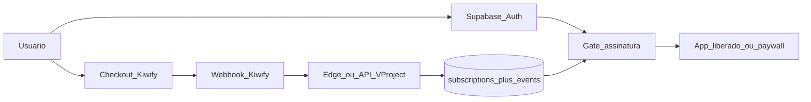

# Assinatura Kiwify → V-Project

Documento de planejamento: controle de assinatura via Kiwify (fase transitória), com migração futura para Asaas.  
**Status:** planejamento — **não implementar até o usuário fornecer os dados listados em “O que preciso de você”.**

---

## Objetivo

Permitir que o V-Project saiba, por usuário:

- se tem assinatura **ativa**
- qual **plano** (ex.: mensal / anual)
- quando **vence / renovou / cancelou**
- se veio de **link de afiliado** (rastreio mínimo)

…e use isso para **liberar ou bloquear** o acesso ao app (ou a features premium), sem depender da área de membros da Kiwify.

A Kiwify é só a **cobrança + afiliados**. O V-Project continua dono da conta (Supabase Auth) e do entitlement (direito de uso).

---

## Princípios

1. **Conta ≠ pagamento** — login (Supabase) separado da assinatura (Kiwify). Ligamos os dois por e-mail e/ou `customer_id` / metadata.
2. **Fonte da verdade no nosso banco** — webhooks da Kiwify atualizam tabelas internas; o app lê só o banco.
3. **Fail-closed no premium, fail-open no bootstrap** — sem assinatura válida → paywall; erros temporários de webhook não devem corromper status sem evidência.
4. **Desacoplado do Asaas** — modelo interno (`subscriptions`) genérico; trocar provedor depois = novo adapter de webhook, não reescrever o app.
5. **Afiliado na Kiwify** — nesta fase o programa de afiliados fica na Kiwify; nós só **registramos** `affiliate_id` / código se vier no webhook (para analytics e suporte).

---

## Arquitetura proposta

### Fluxo feliz (MVP)

1. Usuário cria conta no V-Project (`/auth`) **ou** compra primeiro na Kiwify.
2. Vai ao checkout Kiwify (link do plano / afiliado).
3. Kiwify dispara webhook (`order_approved`, `subscription_canceled`, etc. — nomes exatos conforme docs atuais).
4. Nosso endpoint valida assinatura do webhook, upsert em `subscriptions` + log em `subscription_events`.
5. Matching do comprador → `profiles.id` (preferência: e-mail normalizado; fallback: cupom/código interno).
6. Rotas `_authenticated` (exceto paywall/billing) exigem `subscription.status ∈ {active, trialing}` (política final a confirmar).
7. Cancelamento / chargeback / expiração → status `canceled` / `past_due` / `expired` → paywall na próxima sessão.

### Matching conta ↔ compra (crítico)

Ordem sugerida:

1. E-mail do webhook = e-mail do `auth.users` (case-insensitive, trim).
2. Se não achar: criar registro `subscriptions` **órfão** (`user_id` null) e tela “Vincular compra” no app (usuário logado confirma e-mail da compra).
3. Opcional depois: campo `kiwify_customer_id` / metadata no checkout.

**Não** confiar só em “nome” ou dados editáveis pelo usuário.

---

## Modelo de dados (rascunho)

### `public.subscription_plans` (catálogo interno)

| Campo | Uso |
| --- | --- |
| `id` | uuid |
| `slug` | `mensal`, `anual`, … |
| `name` | label UI |
| `kiwify_product_id` | id do produto/oferta na Kiwify |
| `interval` | `month` / `year` |
| `active` | bool |

### `public.subscriptions` (estado atual por usuário)

| Campo | Uso |
| --- | --- |
| `id` | uuid |
| `user_id` | FK `profiles` (nullable se órfão) |
| `plan_id` | FK plano |
| `provider` | `'kiwify'` (depois `'asaas'`) |
| `provider_subscription_id` | id externo |
| `provider_customer_id` | id externo |
| `status` | `active` \| `trialing` \| `past_due` \| `canceled` \| `expired` \| `incomplete` |
| `current_period_end` | timestamptz |
| `cancel_at_period_end` | bool |
| `affiliate_code` | texto opcional |
| `raw_email` | e-mail da compra (matching) |
| `updated_at` | timestamptz |

### `public.subscription_events` (auditoria imutável)

| Campo | Uso |
| --- | --- |
| `id` | uuid |
| `provider` | `kiwify` |
| `event_type` | string |
| `provider_event_id` | idempotência |
| `payload` | jsonb |
| `processed_at` | timestamptz |
| `subscription_id` | FK opcional |

RLS: usuário lê só a própria `subscriptions`; writes só `service_role` (webhook).

---

## Camadas no código

| Camada | Onde | Responsabilidade |
| --- | --- | --- |
| Webhook | Edge Function Supabase **ou** server route TanStack | Validar secret, idempotência, mapear evento → status |
| Domain | `src/billing/*` (novo) | Tipos, status machine, matching e-mail |
| Gate | `_authenticated/route.tsx` (+ excepções) | Redirect para `/billing` ou `/subscribe` se sem acesso |
| UI | `/subscribe`, `/billing` | CTA Kiwify, status, “vincular compra”, gerenciar (link portal Kiwify se houver) |
| Admin | `/dashitecnology/…` | Lista assinaturas, forçar status (suporte), reprocessar evento |
| Tipos | `src/integrations/supabase/types.ts` | Gerar/atualizar após migration |

---

## Fases de implementação

### Fase 0 — Descoberta (bloqueante)

- Confirmar produtos/planos na Kiwify.
- Confirmar eventos de webhook e payload real (assinatura recorrente).
- Definir política: **tudo atrás do paywall** vs **freemium** (hábitos free / Charlie pago, etc.).

### Fase 1 — Fundação (DB + webhook + status)

- Migrations `subscription_plans`, `subscriptions`, `subscription_events`.
- Endpoint webhook + secret.
- Seed dos planos (ids Kiwify).
- Teste com compra real/sandbox e log de eventos.

### Fase 2 — Gate no app

- Helper `getSubscriptionForUser(userId)`.
- Guard nas rotas autenticadas.
- Páginas `/subscribe` (checkout) e `/billing` (status + vincular).
- Bypass: role `dashi` (e opcional allowlist de e-mails).

### Fase 3 — Afiliados (mínimo)

- Persistir código/id de afiliado do webhook.
- Exibir no admin (quem trouxe a venda).
- Sem payout interno (payout continua na Kiwify).

### Fase 4 — Polimento

- E-mails/notificações internas (assinatura a vencer, falha de cobrança) — opcional.
- Painel admin completo.
- Documentar runbook de suporte (“compra sem conta”, “conta sem compra”).

### Fase 5 — Migração Asaas (depois)

- Novo adapter `provider = asaas`.
- Importar/ mapear assinaturas ativas.
- Desligar checkout Kiwify; afiliados viram programa próprio ou ferramenta à parte.

---

## Fora de escopo (agora)

- Marketplace de afiliados próprio
- Split de pagamento interno
- App Store / Google Play billing
- Área de membros da Kiwify como login do app
- Multi-moeda / internacional

---

## Riscos e mitigações

| Risco | Mitigação |
| --- | --- |
| E-mail da compra ≠ e-mail da conta | Fluxo “vincular compra” + suporte admin |
| Webhook duplicado / fora de ordem | `provider_event_id` único + status machine |
| Usuário cancela mas ainda no período pago | Respeitar `current_period_end` |
| Kiwify muda payload | Adapter versionado + `subscription_events.payload` bruto |
| Travamento de dashi / QA | Bypass por `user_roles.role = dashi` |

---

## O que preciso de você

Preencha / envie o que puder — **itens em negrito são bloqueantes** para começar a Fase 1.

### Conta e produto Kiwify

1. **URL do checkout** (ou links) do(s) plano(s) que vamos vender.
2. **IDs dos produtos/ofertas** na Kiwify (mensal, anual, trial se houver).
3. **Preços e intervalos** oficiais (R$, mensal/anual, trial dias).
4. Confirmação: assinatura é **recorrente nativa** da Kiwify (não só pagamento único disfarçado).

### Webhook e segurança

5. **Secret / token de validação** do webhook (ou print da tela de configuração).
6. **Lista de eventos** que a Kiwify vai enviar para assinatura (aprovada, recusada, cancelada, chargeback, atrasada…).
7. Um **exemplo real de JSON** de webhook (pode anonimizar PII) — ideal: compra aprovada + cancelamento.

### Afiliados

8. Você vai usar **afiliados Kiwify** nesta fase? (sim/não)
9. Se sim: precisamos **persistir** o código do afiliado no nosso banco ou só deixar a Kiwify cuidar?
10. Comissão padrão pretendida (só para documentação/produto; payout é na Kiwify).

### Regras de negócio do V-Project

11. **Modelo de acesso (escolha uma):**
    - A) App inteiro só com assinatura ativa  
    - B) Freemium (o que fica free vs pago — listar)  
    - C) Trial X dias após cadastro sem cartão
12. O que acontece no **cancelamento**: acesso até o fim do período pago? (recomendado: sim)
13. Contas **dashi** / equipe: sempre liberadas? (recomendado: sim)
14. Usuário já existente (beta) ganha **grandfather** / cortesia até data X?

### Conta ↔ compra

15. E-mail do checkout Kiwify **deve ser o mesmo** do login V-Project? (recomendado: sim, e comunicar no funil)
16. Fluxo preferido:
    - A) Cadastrar no app → depois pagar  
    - B) Pagar → depois cadastrar com o mesmo e-mail  
    - C) Ambos aceitos (mais trabalho; recomendado no MVP)

### Operação

17. Ambiente: só **produção** ou Kiwify tem **sandbox** para testes?
18. Quem recebe alerta se webhook falhar? (e-mail/Telegram)
19. Prazo desejado para MVP (só gate + webhook) vs polish.

### Migração futura (só para alinhar)

20. Confirma que Asaas é o destino e que **afiliados na fase Asaas** serão redesenhados (não precisamos clonar o marketplace Kiwify).

---

## Entregáveis do MVP (quando autorizar implementação)

- [ ] Migration + RLS
- [ ] Webhook Kiwify idempotente
- [ ] Matching por e-mail + tela vincular
- [ ] Gate nas rotas autenticadas
- [ ] Páginas subscribe/billing
- [ ] Bypass dashi
- [ ] Página admin básica de assinaturas
- [ ] Runbook curto em `plans/` ou comentário no código de billing

---

## Decisão resumida

| Tema | Proposta |
| --- | --- |
| Provedor fase 1 | Kiwify |
| Provedor fase 2 | Asaas |
| Entitlement | Tabela `subscriptions` no Supabase |
| Afiliados fase 1 | Kiwify (+ log opcional no app) |
| Gate padrão | A confirmar (A/B/C acima) |

Quando os itens bloqueantes estiverem respondidos, implementar na ordem: **Fase 1 → 2 → 3**.
