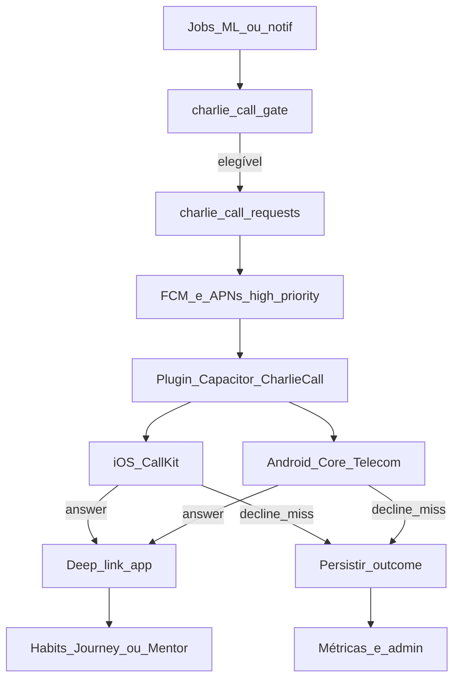

# Charlie Call — ligação nativa sem fala (iOS + Android)

Documento de implementação para a presença urgente do Charlie: **uma “ligação” na UI nativa do sistema**, **sem áudio**, com o **motivo na tela de chamada**.  
**Status:** planejamento completo — **voltar aqui** quando o shell Capacitor + push nativo estiverem estáveis. **Não implementar em produção** antes das pré-condições da §3.

| Campo | Valor |
| --- | --- |
| **Nome interno** | `charlie_call` |
| **Produto** | V-Project · mentor Charlie |
| **Decisão de stack (canônica)** | Plugin Capacitor `CharlieCall` → **iOS CallKit** + **Android Core-Telecom** |
| **Shell** | Capacitor — [`PlanejamentoMobile-Capacitor.md`](./PlanejamentoMobile-Capacitor.md) |
| **Canais irmãos** | Telegram · Web Push · in-app — [`PlanejamentoNotificacoes.md`](./PlanejamentoNotificacoes.md) |
| **Fora de escopo** | `tgcalls` · Bot API de voz · Twilio/PSTN · ligação com fala · Web Push sozinho |

**Princípio:** isto **não** é telefone da operadora. O app pede ao SO a **tela nativa de chamada**, com título/frase do produto, e deep link ao atender.

---

## 0. Decisão cross-platform (ler primeiro ao retomar)

### 0.1 Qual é a melhor opção que atende Android **e** Apple?

**Plugin Capacitor único (`CharlieCall`)** com duas implementações nativas:

| SO | Tecnologia **obrigatória** neste plano | Papel |
| --- | --- | --- |
| **iOS** | **CallKit** (`CXProvider` / `reportNewIncomingCall`) | Único caminho oficial Apple para UI de chamada in-app |
| **Android** | **Core-Telecom** (Jetpack `androidx.core:core-telecom`) | API moderna recomendada pela Google para apps de chamada; encapsula Telecom / foreground |

**Uma API JavaScript** para o app web (TanStack):

```ts
CharlieCall.present / listeners: callAnswered | callDeclined | callMissed | callFailed
```

O React **não** escolhe SO. O plugin despacha para CallKit ou Core-Telecom.

### 0.2 Por que esta stack (e não as alternativas)

| Opção | Atende iOS + Android? | Veredito |
| --- | --- | --- |
| CallKit + Core-Telecom via Capacitor | **Sim** | **Escolhida** — controle da frase na tela, store-friendly com opt-in |
| Só Telegram / voice note | Sim (canal) | Bom **fallback / fase anterior**; **não** é tela de chamada |
| Twilio / PSTN | Sim (telefone real) | Custo, compliance; **não** controla bem o “motivo na tela” |
| `tgcalls` / userbot | Parcial / frágil | **Rejeitada** — ToS, ops, não é caminho de store |
| Web Push sozinho | — | **Insuficiente** — não sobe CallKit nem Telecom |
| Só `ConnectionService` cru (sem Core-Telecom) | Só Android | Spike/estudo ok; **produto** deve preferir Core-Telecom |
| Só sample `platform-samples/telecom` | Só Android (referência) | **Estudo**, não a lib de produção |

### 0.3 Referências oficiais (obrigatórias na Fase 0)

| Plataforma | Usar para |
| --- | --- |
| [CallKit — Apple](https://developer.apple.com/documentation/callkit) | Implementação iOS |
| [Core-Telecom — Android Developers](https://developer.android.com/develop/connectivity/telecom/voip-app/telecom) | Implementação Android **de produto** |
| [platform-samples …/connectivity/telecom](https://github.com/android/platform-samples/tree/main/samples/connectivity/telecom) | **Aprender** o modelo Telecom / self-managed / incoming; **não** copiar como única base de prod se Core-Telecom cobrir o caso |
| Docs CallKit + PushKit (se necessário no spike) | Acordar app para incoming em background no iOS |

**Nota sobre o sample Google Telecom:** é excelente referência do framework. Em 2025/2026 a Google recomenda **Core-Telecom** para apps VoIP/chamada (foreground types, API estável). No Charlie Call: **estudar o sample → implementar com Core-Telecom**.

### 0.4 Ordem de entrega de produto (estratégia)

1. **Agora / curto prazo:** escalada Telegram + push (sem tela de chamada).  
2. **Quando Capacitor + FCM/APNs estiverem verdes:** Fase 0 deste doc (spikes).  
3. **Só então:** Charlie Call em canário.

Não inverter: CallKit sem push nativo confiável = feature que “não toca” no mundo real.

---

## 1. Objetivo de produto

Quando o herói está em risco **real** de quebrar consistência (não atraso trivial), o Charlie pode **“ligar”**:

1. O dispositivo toca / vibra como chamada entrante.
2. A tela mostra **`Charlie`** + motivo curto (ex.: `Streak em risco`).
3. **Não há áudio.** Atender abre o app na ação correta. Recusar registra outcome e respeita quiet hours / cooldown.

### 1.1 Experiência desejada (“funcionamento perfeito”)

| Critério | Definição de pronto |
| --- | --- |
| Confiabilidade | ≥ 95% das chamadas elegíveis chegam em &lt; 60s com app em background (rede ok) |
| Fidelidade de copy | Motivo na tela = template aprovado (evitar truncar no meio da palavra) |
| Consentimento | Zero chamada sem opt-in explícito |
| Anti-spam | Caps diários + quiet hours + cooldown por gatilho |
| Atender | Deep link correto em &lt; 2s após unlock |
| Recusar / timeout | Não re-dispara na mesma janela; persiste outcome |
| Paridade iOS/Android | Mesma semântica de API JS; diferenças só no nativo |
| Store-safe | Opt-in, raro, copy honesta, sem parecer spamware |

### 1.2 O que isto **não** é

- Substituição do Telegram ou do push cotidiano.
- Ligação PSTN (número de telefone verdadeiro).
- Userbot / `tgcalls`.
- Cobrança a cada hábito atrasado 10 minutos.
- Feature só-web.

---

## 2. Arquitetura



### 2.1 Camadas

| Camada | Onde | Responsabilidade |
| --- | --- | --- |
| Decisão | Server job / server fn | Gatilho, quiet hours, caps, opt-in, dedupe |
| Persistência | Supabase | Pedido idempotente + outcomes |
| Transporte | FCM (Android) · APNs (iOS) | Push **data** alta prioridade |
| Nativo | Plugin Capacitor | CallKit **ou** Core-Telecom; reportar answer/decline |
| Web | React / TanStack | Settings, deep link pós-atender, histórico |
| Charlie | Mentor (opcional) | Follow-up **após** answer — não durante a “ligação” |

### 2.2 Por que push data + nativo (não Web Push)

Web Push **não** apresenta CallKit nem Core-Telecom.  
A chamada só existe no **binário Capacitor** com permissões, handlers em background e push nativo confiável.

O web continua UI pós-atender e preferências.

### 2.3 Mapa de pastas sugerido (quando implementar)

```text
plugins/charlie-call/          # Capacitor plugin (ou packages/charlie-call)
  src/definitions.ts           # API JS compartilhada
  ios/Plugin/                  # CallKit
  android/src/.../             # Core-Telecom
src/lib/charlie-call/          # client helpers, types
src/lib/charlie-call.functions.ts  # server: gate, outcome, admin test
supabase/migrations/..._charlie_call.sql
```

---

## 3. Pré-condições (bloqueantes)

Não começar o plugin de produção antes de:

1. **Shell Capacitor** Android (e iOS) com build internal/store estável.  
2. **Push nativo** FCM + APNs com entrega em background **medida**.  
3. Deep links / App Links / Universal Links abrindo rotas autenticadas.  
4. Modelo de opt-in de notificações saudável; Charlie Call = **opt-in separado e mais restrito**.  
5. Gatilhos e caps deste doc (§5 / §4.2) aprovados por produto.

Se push falha em Doze / iOS background, **Charlie Call também falha** — consertar push primeiro.

**Checklist rápido ao retomar:**

- [ ] Capacitor Android green  
- [ ] Capacitor iOS green  
- [ ] FCM data message acorda app  
- [ ] APNs acorda app / CallKit path definido no spike  
- [ ] Deep link `/habits?from=charlie_call` funciona cold start  

---

## 4. Consentimento e segurança (obrigatório)

### 4.1 Opt-in em duas etapas

1. Toggle no perfil: **“Charlie pode me ligar em emergências de consistência”** (off por padrão).  
2. Primeira ativação: bottom sheet com o que acontece (tela de chamada, **sem áudio**), quando (só gatilhos graves), quiet hours padrão (22:00–07:00 no timezone do perfil), como desligar, link privacidade/termos.

Sem toggle **e** sem permissão de notificação do SO → **nunca** enfileirar.

### 4.2 Hard rules (fail-closed)

| Regra | Valor MVP |
| --- | --- |
| Máx. chamadas / dia / usuário | **1** |
| Máx. chamadas / semana / usuário | **3** |
| Cooldown global após qualquer chamada | **20 horas** |
| Cooldown por mesmo `trigger_key` | **72 horas** |
| Quiet hours | `profiles.location_timezone` (fallback `America/Sao_Paulo`) |
| Role `dashi` | Teste com `force_test` só via admin / build internal |
| Dúvida no gate | **Não ligar** (Telegram/push ainda podem) |

### 4.3 Segurança técnica

- Payload de push **assinado** (`call_request_id` + HMAC ou JWT curto).  
- `call_request_id` uuid **idempotente** (reentrega FCM ≠ 2ª UI).  
- TTL do pedido: **10–15 min**; expirado → `expired`, não mostrar.  
- Sem PII sensível no título (sem e-mail/endereço).  
- Logs: user, trigger, outcome, timestamps — **sem áudio**.  
- RLS: usuário lê só os próprios registros; writes de pedido só `service_role`.

### 4.4 Store review

Informar Review Notes / Play:

- Opt-in, frequência baixa, propósito coach de consistência.  
- Usuário desliga em 2 toques.  
- Não é robocall PSTN.  
- Caller sempre **Charlie** / V-Project — nunca imitar banco, governo, “urgente demais”.

---

## 5. Gatilhos (MVP conservador)

| `trigger_key` | Condição (exemplo) | Prioridade |
| --- | --- | --- |
| `streak_break_imminent` | Streak &gt; 0 e risco alto de quebrar nas próximas **2h** | **P0** (canário primeiro) |
| `chapter_mission_deadline` | Missão principal &lt; 24h e progresso 0 | P1 |
| `mentor_challenge_expiring` | Desafio Charlie &lt; 6h sem progresso | P1 |

**Fora do MVP:** atraso leve de hábito, humor, marketing, upsell Kiwify.

Colisão: um único pedido por ciclo (maior prioridade; empate → streak).

---

## 6. Copy na tela de chamada

| Plataforma | Campo | Limite prático |
| --- | --- | --- |
| iOS CallKit | `localizedCallerName` | ~20–32 chars (testar device) |
| Android Core-Telecom | display name / CallAttributes | Mirar ≤ 32 chars |
| Subtítulo | Opcional | Nem sempre visível |

| `trigger_key` | `caller_name` | `reason` |
| --- | --- | --- |
| `streak_break_imminent` | `Charlie` | `Streak em risco` |
| `chapter_mission_deadline` | `Charlie` | `Missão do capítulo` |
| `mentor_challenge_expiring` | `Charlie` | `Desafio expirando` |

Personalidades do Charlie **não** mudam o nome na tela. Tom da personalidade só no chat **após** atender.

| Trigger | Deep link |
| --- | --- |
| streak | `/habits?from=charlie_call` (ou hábito crítico) |
| missão | `/journey?from=charlie_call` |
| desafio | `/mentor?from=charlie_call` |

---

## 7. Modelo de dados

### 7.1 `profiles`

| Campo | Tipo | Default | Uso |
| --- | --- | --- | --- |
| `charlie_call_opt_in` | boolean | `false` | Consentimento |
| `charlie_call_quiet_start` | time | `22:00` | Quiet start (local) |
| `charlie_call_quiet_end` | time | `07:00` | Quiet end |
| `charlie_call_opt_in_at` | timestamptz | null | Auditoria |

### 7.2 `charlie_call_requests`

| Campo | Uso |
| --- | --- |
| `id` | uuid PK |
| `user_id` | FK profiles |
| `trigger_key` | texto estável |
| `priority` | int |
| `caller_name` / `reason` | UI |
| `deep_link_path` | path interno |
| `status` | `queued` \| `pushed` \| `displayed` \| `answered` \| `declined` \| `missed` \| `expired` \| `failed` \| `suppressed` |
| `suppress_reason` | se gate bloqueou |
| `idempotency_key` | UNIQUE |
| `push_message_id` | FCM/APNs |
| `expires_at` | timestamptz |
| `displayed_at` / `answered_at` / `declined_at` | |
| `device_platform` | `ios` \| `android` \| null |
| `created_at` / `updated_at` | |

Índices: `idempotency_key` único; `(user_id, created_at desc)` para caps.

### 7.3 Gate (fail-closed)

```text
SE NOT charlie_call_opt_in → suppress(no_opt_in)
SE NOT device_push_token_nativo → suppress(no_native_device)
SE agora ∈ quiet_hours(timezone) → suppress(quiet_hours)
SE count(calls_today) >= 1 → suppress(daily_cap)
SE count(calls_7d) >= 3 → suppress(weekly_cap)
SE last_call_at < 20h → suppress(global_cooldown)
SE last_same_trigger < 72h → suppress(trigger_cooldown)
SE NOT trigger_condition_met → suppress(condition_false)
SE feature_flag off → suppress(flag_off)
SENÃO insert queued + send push
```

Logar **todos** os `suppressed_*` para calibrar sem ligar à toa.

### 7.4 Tokens de device

Reutilizar / estender tabela de push nativo do Capacitor (quando existir) com:

- `platform` (`ios` \| `android`)
- `token`
- `charlie_call_capable` (bool: app versão ≥ plugin)

Sem token capable → suppress `no_native_device`.

---

## 8. Contrato do push nativo

```json
{
  "type": "charlie_call",
  "call_request_id": "uuid",
  "caller_name": "Charlie",
  "reason": "Streak em risco",
  "deep_link_path": "/habits?from=charlie_call",
  "expires_at": "2026-08-05T23:15:00.000Z",
  "sig": "hmac_or_jwt"
}
```

| SO | Transporte |
| --- | --- |
| Android | FCM **data** (alta prioridade) → plugin → Core-Telecom `addCall` / incoming |
| iOS | APNs (modelo definido no spike: PushKit VoIP **só se** Review aceitar o caso de uso; senão remote notification + CallKit path documentado) → CallKit |

**Validação no device:** assinatura → TTL → idempotência `call_request_id` → apresentar UI.

> **Spike iOS crítico:** validar com Apple guidelines se PushKit VoIP é permitido para “chamada sem mídia de voz real”. Se Review rejeitar VoIP push para este uso, documentar plano B (notification + full-screen intent / CallKit only when app pode acordar). **Não assumir PushKit livre** sem spike.

---

## 9. Plugin Capacitor `CharlieCall`

### 9.1 API JS (contrato estável)

```ts
export interface CharlieCallPlugin {
  setEnabled(options: { enabled: boolean }): Promise<void>;

  /** Só debug / dashi / TestFlight internal. */
  presentTestCall(options: {
    callRequestId?: string;
    callerName: string;
    reason: string;
    deepLinkPath: string;
  }): Promise<void>;

  addListener(
    event: "callAnswered" | "callDeclined" | "callMissed" | "callFailed",
    cb: (e: {
      callRequestId: string;
      deepLinkPath?: string;
      platform: "ios" | "android";
    }) => void,
  ): Promise<PluginListenerHandle>;
}
```

Push receiver nativo **inicia a UI sem depender do JS**. JS sincroniza outcome quando o WebView sobe.

### 9.2 iOS — CallKit (obrigatório)

- `CXProvider` + configuração adequada (`supportsVideo = false`).  
- `reportNewIncomingCall` com `localizedCallerName` (ex.: `Charlie` ou `Charlie · Streak`).  
- Answer → fulfill + evento bridge + deep link.  
- Decline / end → outcome.  
- MVP: **sem** `AVAudioSession` de voz (não há fala).  
- Info.plist: textos honestos.  
- Background: Remote notifications; PushKit **somente** se spike §8 aprovar.

**Referência:** [CallKit](https://developer.apple.com/documentation/callkit).

### 9.3 Android — Core-Telecom (obrigatório em produto)

- Dependência Jetpack **Core-Telecom**.  
- Registrar capacidade de chamada self-managed conforme docs.  
- Incoming via APIs da lib (`CallsManager` / `CallAttributesCompat` — nomes conforme versão atual da lib no momento da implementação).  
- `callerDisplayName` / atributos = copy da §6.  
- Notificação de chamada / foreground **dentro do prazo exigido pelo SO** (docs: postar notificação rapidamente após add call).  
- Canal de notificação dedicado (importância alta); **não** misturar com marketing.  
- OEM QA: Samsung, Xiaomi, Motorola (autostart, battery).  

**Referência produto:** [Core-Telecom](https://developer.android.com/develop/connectivity/telecom/voip-app/telecom).  
**Referência estudo:** [platform-samples/telecom](https://github.com/android/platform-samples/tree/main/samples/connectivity/telecom).

Se Core-Telecom na versão pinada **não** cobrir incoming self-managed do jeito necessário, fallback documentado: `ConnectionService` self-managed alinhado ao sample — **com issue aberta** para migrar de volta à lib.

### 9.4 Sincronização WebView

- `callAnswered` → `navigate({ to: deepLinkPath })` + `markCharlieCallOutcome`.  
- Cold start: `charlie_call_id` / path na intent → processar no boot do app Capacitor.  
- Retry de outcome se offline.

---

## 10. Integração Charlie (pós-atender)

1. Abrir deep link.  
2. (MVP+) Uma mensagem do mentor no tom da personalidade ativa.  
3. Sem TTS automático no MVP da chamada.  

Declined/missed: não bombardear; opcional 1 Telegram após 30–60 min (fase posterior).

---

## 11. UI no app

`/profile` (ou Notificações):

- Toggle Charlie Call (off default).  
- Quiet hours.  
- Texto claro: sem áudio; só riscos graves; máx. 1×/dia.  
- Histórico das últimas 5.  
- **Testar chamada** só `dashi` / internal.

Feature flag remota: `charlie_call_enabled` (off no dia 1 de prod).

---

## 12. Observabilidade

| Métrica | Uso |
| --- | --- |
| `requests_queued` / `suppressed_*` | Gate |
| `push_sent` / `push_failed` | Infra |
| `displayed` / `answered_rate` / `declined_rate` / `missed_rate` | Produto |
| `time_to_display_p95` | SLA |
| Opt-out 7d após 1ª call | Saúde |
| Breakdown `ios` vs `android` | Paridade |

Admin `/dashitecnology`: lista, suppress, disparo teste dashi.

Alertas: spike `failed`, queda `displayed`, opt-out alto.

---

## 13. Fases de implementação

### Fase 0 — Spikes (autorizar primeiro)

- Confirmar §3.  
- Spike **iOS CallKit** (botão teste, sem push).  
- Spike **Android Core-Telecom** (botão teste, sem push).  
- Spike push → UI (cada SO).  
- Decisão escrita sobre PushKit vs plano B iOS.  
- Gravar vídeos + lista OEM.

**Branch sugerida:** `feat/charlie-call-spike`  
**Exit:** spikes ok nos dois SOs + doc de limitações preenchido neste arquivo (apêndice).

### Fase 1 — Fundação server/UI

- Migration + RLS.  
- Settings opt-in.  
- Gate + dry-run (só logs).  
- Zero chamada real em prod.

### Fase 2 — Plugin + push ponta a ponta

- Plugin iOS + Android.  
- Assinatura payload + TTL + idempotência.  
- Outcomes + deep link.  
- Flag off em prod; TestFlight / internal track.

### Fase 3 — Canário

- Só `streak_break_imminent`.  
- 5% (ou allowlist) dos opt-in.  
- 7 dias de métricas.

### Fase 4 — Expandir

- Demais gatilhos P1.  
- Follow-up Charlie.  
- Runbook OEM.

### Fase 5 — Polimento

- Quiet hours inteligentes.  
- A/B copy (flag).  
- Hardening Review Notes.

---

## 14. Testes

### 14.1 Devices mínimos

iPhone recente · iPhone + Focus · Pixel · Samsung · Xiaomi/Motorola.

### 14.2 Server automatizado

Opt-in, caps, quiet hours, idempotency, TTL, assinatura inválida, feature flag.

### 14.3 Nativo manual

Answer/decline, double push, cold start deep link, opt-out mid-flight, OEM battery saver.

### 14.4 Pronto para canário

- [ ] 0 crashes em ≥ 50 chamadas teste / plataforma  
- [ ] Idempotência ok  
- [ ] Opt-out &lt; meta definida na Fase 0 (sugestão inicial 15% em 7d)  
- [ ] Checklist stores ok  
- [ ] Paridade semântica iOS/Android na API JS  

---

## 15. Falhas e fallbacks

| Falha | Comportamento |
| --- | --- |
| Sem token nativo | `suppressed(no_native_device)` + Telegram se opt-in |
| Push não delivered | `expired`; opcional Telegram |
| SO rejeita UI de chamada | `failed`; sem retry agressivo |
| Quiet hours | suppress e **descarta** no MVP (não agendar 07:01) |
| App desinstalado | limpar token |

Escalada de produto: in-app/push → Telegram → **Charlie Call**.

---

## 16. Relação com outros canais

| Canal | Papel |
| --- | --- |
| In-app / Web Push | Leve / médio |
| Telegram | Texto; fallback; futuro voice note |
| Charlie Call | Último degrau, raro |
| E-mail | Não |

---

## 17. Riscos e mitigações

| Risco | Mitigação |
| --- | --- |
| Rejeição App Store (PushKit / CallKit misuse) | Spike §8; Review Notes honestas; plano B sem VoIP push |
| Play / OEM | Core-Telecom + canal dedicado + QA OEM + fallback Telegram |
| Irritação do usuário | Caps; opt-out; canário |
| Push forjado | HMAC/JWT + TTL + idempotency |
| Parecer golpe | Sempre “Charlie”; nunca marcas de banco/gov |
| Scope creep (falar na linha) | Fora de escopo explícito |
| Drift iOS vs Android | Contrato JS único + testes de paridade |

---

## 18. Estimativa (ordem de grandeza)

| Fase | Esforço |
| --- | --- |
| 0 Spikes | 3–5 dias-eng (2 SOs + push) |
| 1 Fundação | 2–3 dias |
| 2 Plugin+push | 1–2 semanas |
| 3 Canário | 3–5 dias + 1 semana observação |
| 4–5 | Contínuo |

Dominado pela maturidade do push Capacitor (§3).

---

## 19. Checklist de implementação (quando autorizar)

- [ ] Pré-condições §3  
- [ ] Decisão PushKit vs plano B documentada  
- [ ] Migration + RLS  
- [ ] Settings opt-in + quiet hours  
- [ ] Gate fail-closed + `suppressed_*`  
- [ ] Plugin **iOS CallKit**  
- [ ] Plugin **Android Core-Telecom** (fallback ConnectionService só se necessário)  
- [ ] Push data assinado + TTL  
- [ ] Outcomes + deep link  
- [ ] Feature flag + canário  
- [ ] Testes §14  
- [ ] App Review / Play notes  
- [ ] Runbook OEM  
- [ ] Apêndice de limitações preenchido (§22)  

---

## 20. Decisão resumida

| Tema | Decisão |
| --- | --- |
| Cross-platform | **Capacitor plugin `CharlieCall`** |
| iOS | **CallKit** |
| Android | **Core-Telecom** (sample Telecom = estudo) |
| Áudio | Nenhum no MVP |
| Consentimento | Opt-in off por default |
| Frequência | 1/dia · 3/semana · cooldowns |
| Gatilho canário | `streak_break_imminent` |
| Fallback | Telegram / push textual |
| Web sozinho | Insuficiente |

---

## 21. Como retomar este doc (runbook humano)

1. Ler §0 (stack) + §3 (pré-condições).  
2. Se Capacitor/push não verdes → **não** abrir Fase 0; seguir Telegram/push.  
3. Se verdes → autorizar **só Fase 0** em `feat/charlie-call-spike`.  
4. Preencher §22 com achados reais dos spikes.  
5. Só então Fase 1–2 com flag off.  
6. Canário Fase 3 com métricas da §12.

**Perguntas a responder na retomada:**

- [ ] Versão pinada do `androidx.core:core-telecom`?  
- [ ] PushKit aprovado no nosso caso de uso ou plano B iOS?  
- [ ] Caps da §4.2 ainda ok para produto?  
- [ ] Quem opera o canário (dashi allowlist)?  

---

## 22. Apêndice — achados da Fase 0 (preencher depois)

| Item | Achado | Data |
| --- | --- | --- |
| CallKit incoming (teste local) | _TBD_ | |
| Core-Telecom incoming (teste local) | _TBD_ | |
| FCM → UI (Android) | _TBD_ | |
| APNs → UI (iOS) | _TBD_ | |
| PushKit viável? | _TBD_ | |
| Limite real de chars no nome | _TBD_ | |
| OEM piores | _TBD_ | |
| Decisão final Android lib | Core-Telecom / fallback CS | |

---

## 23. Próximo passo humano (agora)

1. Avançar [`PlanejamentoMobile-Capacitor.md`](./PlanejamentoMobile-Capacitor.md) até push nativo estável.  
2. Manter Telegram como canal de urgência.  
3. Quando §3 estiver verde, autorizar **Fase 0** e voltar a este arquivo na §21.
