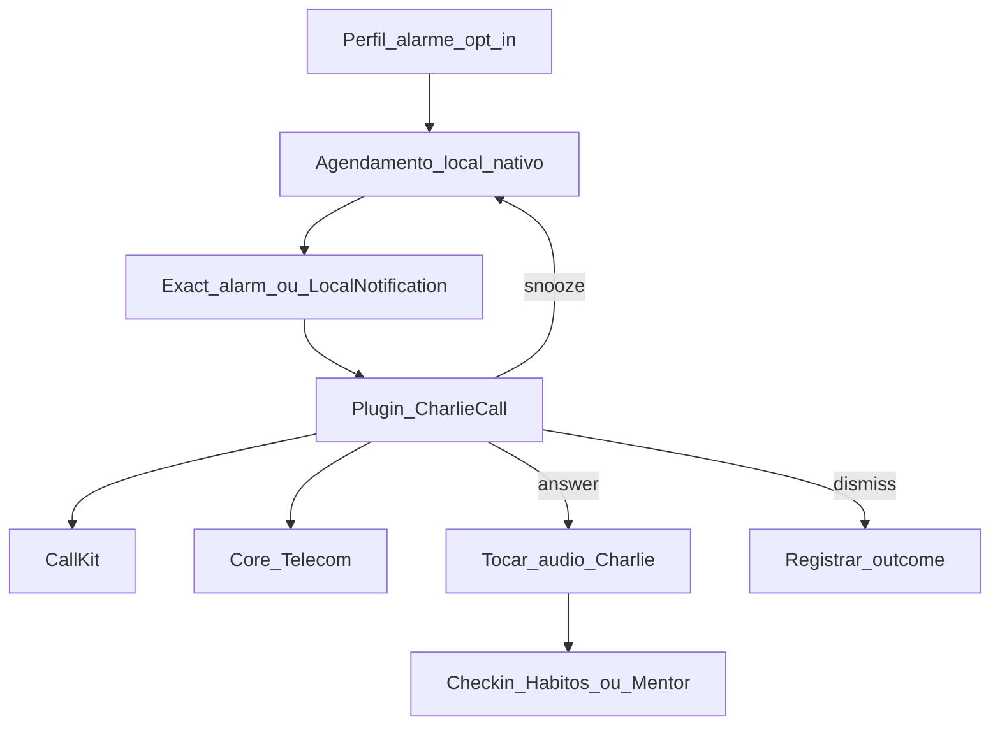

# Charlie Despertador — MVP + planejamento + TODOs

Documento único: despertador do Charlie via **“ligação” in-app** (não é PSTN) + áudio de voz, no shell **Capacitor**.

| Campo | Valor |
| --- | --- |
| **Nome interno** | `charlie_alarm` |
| **Produto** | V-Project · mentor Charlie |
| **Status** | Planejamento — **não implementar** antes das pré-condições (§3) |
| **Shell** | Capacitor — [`PlanejamentoMobile-Capacitor.md`](./PlanejamentoMobile-Capacitor.md) |
| **Irmão (urgência)** | [`Charlie-Call-Nativo.md`](./Charlie-Call-Nativo.md) — mesma stack CallKit / Core-Telecom |
| **Irmão (voz)** | [`PlanejamentoVozCharlie.md`](./PlanejamentoVozCharlie.md) — TTS / persona vocal |
| **Canais** | Local alarm nativo + tela de chamada + áudio; Telegram/push como fallback |

**Princípio:** o herói agenda um horário; no horário o celular **toca como chamada do Charlie**; ao atender, toca **áudio curto** (arquivo gravado no MVP; TTS depois). Não é despertador do sistema Android/iOS genérico — é presença do mentor.

---

## 1. Visão de produto

### 1.1 Experiência desejada

1. Herói define horário (ex.: 06:30) + dias da semana + opt-in.
2. No horário, o dispositivo **vibra/toca** como chamada entrante.
3. Tela: **`Charlie`** + frase curta (`Hora de subir` / tom da personalidade).
4. **Atender** → abre o app (tela de “chamada” / ritual matinal) e **toca áudio** do Charlie.
5. **Adiar** (snooze 5–10 min) ou **desligar**.
6. Opcional pós-áudio: deep link para check-in / hábitos / mentor.

### 1.2 Por que juntar “ligação falsa” + despertador

| Peça | Papel |
| --- | --- |
| CallKit / Core-Telecom | Faz o telefone **acordar e chamar atenção** como ligação |
| Áudio (MP3/OGG) | Charlie **fala** — presença, não só texto |
| Capacitor | Único caminho realista com app fechado / tela off |

Web/PWA **sozinho** não entrega despertador confiável.

### 1.3 O que isto **não** é (MVP)

- Ligação de operadora / Twilio / `tgcalls`
- TTS dinâmico em toda manhã (fase 2+)
- Substituir o despertador nativo do SO para todos os usos
- Cobrar hábito atrasado a cada 10 min com “ligação”
- Feature só-web

---

## 2. Arquitetura (alvo)



### 2.1 Camadas

| Camada | Responsabilidade |
| --- | --- |
| **Web/React** | UI de configuração; ritual pós-atender; preferências sync Supabase |
| **Plugin Capacitor `CharlieCall`** | Tela de chamada (reuso do plano Charlie Call) |
| **Plugin / API de alarme** | Agendamento local exato + snooze (pode ser extensão do mesmo plugin ou `LocalNotifications` + bridge) |
| **Áudio** | Assets empacotados ou baixados; `HTMLAudioElement` / nativo após answer |
| **Backend** | Preferências, métricas, feature flag — **não** dispara o alarme (o alarme é **local**) |

**Decisão crítica:** o despertador diário é **agendado no device**. Servidor não precisa “ligar” às 6h (fuso, offline, Doze). O Charlie Call de **urgência ML** (streak) continua podendo ser **push → chamada**; o despertador é outro gatilho.

### 2.2 Relação com Charlie Call (urgência)

| | Charlie Call (urgência) | Charlie Despertador |
| --- | --- | --- |
| Gatilho | Job ML / atraso / streak | Relógio local agendado |
| Transporte | FCM/APNs high priority | Exact alarm / local schedule |
| UI | CallKit / Core-Telecom | **Mesmo plugin** |
| Áudio MVP | Sem fala (plano original) | **Com áudio** ao atender |
| Frequência | Raro, anti-spam | Diário (opt-in) |

**Recomendação:** um plugin `CharlieCall`, dois modos: `urgency` e `alarm`.

---

## 3. Pré-condições (bloqueantes)

Não começar o despertador em produção sem:

1. Shell Capacitor Android (e caminho iOS) publicado ou em beta interno — [`PlanejamentoMobile-Capacitor.md`](./PlanejamentoMobile-Capacitor.md)
2. Push nativo estável (FCM / APNs) — útil para urgência e re-sync de preferências
3. Spike verde de **alarme exato** (Android) + **notificação time-sensitive** (iOS)
4. Spike verde de CallKit / Core-Telecom apresentando chamada com app em background
5. Opt-in explícito + copy honesta para lojas (não parecer spamware)

---

## 4. MVP (definição de pronto)

### 4.1 Escopo do MVP

| Inclui | Fora do MVP |
| --- | --- |
| 1 horário + dias da semana | Vários alarmes complexos |
| Opt-in / opt-out | TTS |
| Chamada nativa + áudio **padrão único** (Charlie clássico) | Uma voz por personalidade |
| Atender → play áudio → botão “Abrir hábitos” | Chat ao vivo com Charlie |
| Snooze 1× (5 ou 10 min) | Snooze infinito / matemática avançada |
| Android primeiro (canário) | iOS no mesmo sprint (iOS = fase seguinte se spike atrasar) |
| Métricas: scheduled / fired / answered / dismissed / snoozed | Admin completo de A/B de voz |

### 4.2 Áudio MVP

- 1 arquivo curto (15–25 s), tom mentor, PT-BR.
- Texto sugerido (clássico):  
  *“É Charlie. O dia começou. Levanta, respira, e marca o primeiro hábito. A jornada não espera.”*
- Formato: `.m4a` ou `.ogg` empacotado em `public/audio/charlie-alarm-classico.m4a` (ou assets nativos).
- Sem dependência de rede no momento do alarme (arquivo local).

### 4.3 Critérios de pronto (MVP)

| Critério | Meta |
| --- | --- |
| Disparo | ≥ 90% no horário ±2 min com app morto (device de teste, Android) |
| Atender | Áudio inicia em &lt; 2 s após answer |
| Offline | Funciona sem internet (áudio local) |
| Consentimento | Zero alarme sem opt-in |
| Quiet / desligar | Usuário consegue desativar em &lt; 3 taps |
| Store narrative | Descrito como despertador do mentor, opt-in |

### 4.4 UX mínima (telas)

1. **Config** (Perfil ou Charlie): toggle + horário + dias + preview do áudio.
2. **Incoming call** (nativo): Charlie · “Hora de subir”.
3. **Ritual** (WebView pós-answer): player + “Ir para hábitos” / “Falar com Charlie” / “Pronto”.

---

## 5. Planejamento por fases

### Fase 0 — Spikes (1–2 semanas)

- [ ] Exact alarm Android (`USE_EXACT_ALARM` / `SCHEDULE_EXACT_ALARM`) com app killed
- [ ] iOS: time-sensitive notification + CallKit incoming (mesmo morto / background)
- [ ] Play de áudio **após** answer (política de silent mode / Focus)
- [ ] Decisão: plugin único vs LocalNotifications + CharlieCall
- [ ] Doc de permissões + justificativa Play/App Store

### Fase 1 — MVP Android (canário)

- [ ] Preferências em `profiles` ou tabela `charlie_alarms`
- [ ] Agendamento local ao salvar / ao abrir app / ao boot (receiver se necessário)
- [ ] Integração CallKit-equivalent Android (Core-Telecom) no modo `alarm`
- [ ] Áudio padrão + tela ritual
- [ ] Snooze + dismiss + métricas básicas
- [ ] Feature flag `charlie_alarm_enabled`

### Fase 2 — iOS + polish

- [ ] Paridade iOS (CallKit + áudio)
- [ ] Frases na tela por personalidade (templates, sem TTS)
- [ ] Deep link pós-áudio para check-in matinal
- [ ] Quiet hours alinhadas às notificações

### Fase 3 — Voz rica

- [ ] Um áudio (ou TTS cacheado) por personalidade — ver [`PlanejamentoVozCharlie.md`](./PlanejamentoVozCharlie.md)
- [ ] Opcional: frase com nome do herói (TTS ou concat)
- [ ] Biblioteca de variações (evitar always-the-same)

### Fase 4 — Unificar com urgência

- [ ] Mesmo plugin para `urgency` (streak) e `alarm` (despertador)
- [ ] Caps / anti-spam compartilhados onde fizer sentido
- [ ] Admin: ver taxa de answer / snooze

---

## 6. Dados (proposta)

```sql
-- Esboço — migration real só na implementação
create table public.charlie_alarms (
  id uuid primary key default gen_random_uuid(),
  user_id uuid not null references auth.users(id) on delete cascade,
  enabled boolean not null default false,
  time_local time not null,           -- horário na timezone do usuário
  days_of_week smallint[] not null,   -- 0=dom … 6=sáb (ou 1–7 ISO — decidir no impl)
  timezone text not null default 'America/Sao_Paulo',
  snooze_minutes int not null default 5,
  audio_key text not null default 'classico',
  updated_at timestamptz not null default now(),
  unique (user_id)  -- MVP: 1 alarme por usuário
);
```

Outcomes (opcional, analytics):

```text
charlie_alarm_events: user_id, fired_at, outcome (answered|dismissed|snoozed|missed), platform
```

Preferências sensíveis ficam no device (próximo disparo) **e** no Supabase (backup / multi-device depois).

---

## 7. Riscos e mitigações

| Risco | Mitigação |
| --- | --- |
| Android Doze atrasa alarme | Exact alarm + `allowWhileIdle`; testar OEM (Xiaomi/Samsung) |
| Play rejeita `USE_EXACT_ALARM` | Justificar uso central (despertador); fallback `SCHEDULE_EXACT_ALARM` + UX de permissão |
| iOS não toca com Focus | Time Sensitive + CallKit; copy pedindo exclusão do Focus |
| Áudio não toca até unlock | Fluxo: answer → foreground → play; não prometer speaker com tela bloqueada |
| Usuário odeia (spam) | Opt-in, fácil off, 1 alarme, sem urgência misturada no MVP |
| Duplicar lógica Call vs Alarm | Um plugin, dois modos |

---

## 8. TODOs (checklist de execução)

### Agora (produto / docs)

- [x] Documentar ideia (este arquivo)
- [ ] Validar com dono do produto: Android-first ok? Snooze 5 ou 10?
- [ ] Escrever 1 roteiro de áudio MVP e gravar (ou contratar voz)
- [ ] Ligar este doc no índice de plans / Capacitor (§ features futuras)

### Pré-Capacitor

- [ ] Não implementar UI web de alarme “de verdade” que prometa despertar no browser
- [ ] Manter Telegram voice/texto como presença matinal **leve** se quiser testar copy antes do nativo

### Quando Capacitor existir

- [ ] Spike Fase 0 (checklist §5)
- [ ] Schema `charlie_alarms` + RLS
- [ ] UI Config no app
- [ ] Plugin modo `alarm`
- [ ] Canário interno (5–20 usuários)
- [ ] Métricas answer rate
- [ ] iOS Fase 2
- [ ] Personalidades / TTS Fase 3

### Fora de escopo explícito (não TODO agora)

- [ ] PSTN / Twilio
- [ ] Despertador sem Capacitor
- [ ] TTS em toda mensagem do mentor

---

## 9. Ordem recomendada (resumo executivo)

1. Capacitor + push  
2. Spike alarme exato + CallKit/Core-Telecom  
3. **MVP Despertador** (áudio padrão, Android)  
4. iOS  
5. Voz por personalidade / TTS  
6. Unificar com Charlie Call de urgência  

---

## 10. Decisões abertas (preencher na implementação)

| Pergunta | Opções | Decisão |
| --- | --- | --- |
| Snooze | 5 min / 10 min / configurável | _tbd_ |
| Dias default | Seg–Sex / todos | _tbd_ |
| Pós-áudio default | Hábitos / Check-in / Mentor | _tbd_ |
| Android-first | Sim / iOS junto | **Sugestão: Sim** |
| Áudio inicial | Gravação humana / ElevenLabs one-shot | _tbd_ |

---

*Última atualização: 2026-08-07 — ideia aprovada para planejamento; implementação bloqueada por Capacitor + spikes nativos.*
