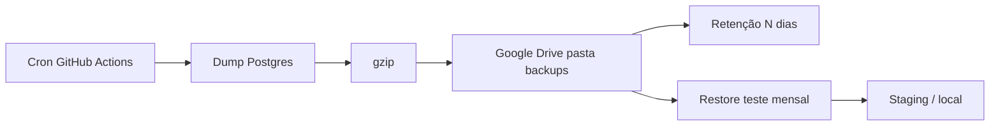

# Planejamento — Backup Supabase → Google Drive

Rotina de backup **off-site** do Postgres (e, numa fase 2, Storage) para o **Google Drive**, complementar aos backups nativos do Supabase.

**Status:** planejamento — **não implementado** (implementar quando priorizar).  
**Decisão de destino:** Google Drive (conta do projeto / Dashi).  
**Objetivo:** ter cópia restaurável sob nosso controle, além do backup diário da plataforma.

---

## Contexto e princípios

### O que o Supabase já faz
| Plano | Backup automático | Retenção típica | Observação |
| --- | --- | --- | --- |
| Free | Não confiável / ausente | — | Dump próprio é obrigatório |
| Pro | Diário | ~7 dias | Bom como rede de segurança |
| Team | Diário | ~14 dias | Idem |
| PITR (add-on) | Contínuo | 7/14/28 dias | ~US$100+/mês — fora de escopo agora |

Backups nativos **não incluem** arquivos do Storage (só o banco / metadados). Edge Functions e secrets **não** entram no dump.

### O que vamos construir
1. Dump lógico do banco (`schema` + `data`) em horário fixo  
2. Upload para pasta no Google Drive  
3. Retenção (apagar dumps antigos)  
4. Documentação de **restore** testada  
5. (Fase 2) espelho seletivo de buckets Storage críticos  

### Princípios
- Backup que **nunca foi restaurado** não conta como backup → teste periódico obrigatório  
- Segredos **nunca** no repositório (Service Account JSON só em GitHub Secrets / `.env` local)  
- Preferir **Service Account** + pasta compartilhada (automação estável) em vez de OAuth pessoal  
- Dump criptografado em trânsito (HTTPS) e, se possível, **arquivo `.dump`/`.sql.gz` com permissões restritas** na pasta do Drive  
- Falha do job deve **avisar** (e-mail GitHub / Discord webhook / Telegram) — não falhar em silêncio  

---

## Arquitetura proposta

```
GitHub Actions (cron diário, ex. 07:00 UTC ≈ 04:00 BRT)
  → supabase db dump (schema + data)  OU  pg_dump via connection string
  → comprimir (.sql.gz ou .dump.gz)
  → upload Google Drive (Service Account → pasta compartilhada)
  → limpar dumps locais do runner
  → policy de retenção no Drive (manter N dias / N arquivos)
  → (opcional) notificar sucesso/falha
```

**Restore (manual / script):**
```
Baixar .sql.gz do Drive
  → projeto staging Supabase (ou local Docker)
  → psql / supabase db reset + apply dump
  → smoke test (login, habits, notifications)
```



---

## O que você precisa preparar (checklist)

Preencha quando for implementar. Sem Service Account + pasta compartilhada o upload automatizado não fecha.

### Bloqueantes

| # | Item | Como | Status |
| --- | --- | --- | --- |
| 1 | Plano Supabase (ideal: **Pro**) | Confirmar backups nativos ligados | ⏳ |
| 2 | Projeto Google Cloud (ou Workspace) | console.cloud.google.com | ⏳ |
| 3 | **Service Account** com JSON key | IAM → Service Accounts → Keys | ⏳ |
| 4 | Google Drive API habilitada | APIs & Services → Enable Drive API | ⏳ |
| 5 | Pasta no Drive (ex.: `V-Project/Backups/DB`) | Criar pasta; copiar **Folder ID** da URL | ⏳ |
| 6 | Compartilhar pasta com o e-mail da Service Account (`...@....iam.gserviceaccount.com`) como **Editor** | Sem isso o upload falha | ⏳ |
| 7 | `SUPABASE_ACCESS_TOKEN` ou DB URL para dump | Já existe `SUPABASE_TOKEN` no `.env` | ⏳ confirmar |
| 8 | Onde rodar o cron | Preferência: **GitHub Actions** (repo já no GitHub) | ✅ sugerido |

### Opcionais

| # | Item | Por quê | Status |
| --- | --- | --- | --- |
| 9 | Webhook Discord/Telegram para alerta de falha | Visibilidade | ⏳ |
| 10 | Projeto Supabase **staging** | Restore sem tocar produção | ⏳ |
| 11 | Backup de Storage (`popup-images`, etc.) | Arquivos não vão no dump SQL | Fase 2 |
| 12 | Criptografia adicional (gpg) antes do upload | Compliance / paranoia | opcional |

### Secrets (GitHub Actions / local)

| Secret | Onde | Notas |
| --- | --- | --- |
| `SUPABASE_ACCESS_TOKEN` | GitHub Secrets | Pode espelhar `SUPABASE_TOKEN` do `.env` |
| `SUPABASE_PROJECT_ID` | GitHub Secrets | `gmzddccyikpxbiozsiue` |
| `GOOGLE_SERVICE_ACCOUNT_JSON` | GitHub Secrets | JSON inteiro da key (uma linha ou base64) |
| `GOOGLE_DRIVE_FOLDER_ID` | GitHub Secrets | ID da pasta de backups |
| `BACKUP_ALERT_WEBHOOK` | opcional | Discord/Telegram |

> Nunca commitiar o JSON da Service Account. Rotacionar a key se vazar.

---

## Escopo do dump (fase 1)

**Incluir**
- Schema público (`public.*`) — profiles, habits, notifications, mentor_*, ML, discord/telegram codes, etc.  
- Dados de todas as tabelas de aplicação  
- Extensões necessárias documentadas no restore  

**Excluir / tratar com cuidado**
- Objetos só de `auth` / `storage` internos: decidir se dump **completo do projeto** (`supabase db dump --linked`) ou só `public`  
- **Recomendação:** dump via CLI do projeto linkado (schema + data) cobrindo o que a app precisa para reerguer; documentar se auth users entram ou não  

**Decisão a fechar na implementação**
- [ ] Dump **full project** (recomendado para restore real) vs só `public`  
- [ ] Incluir roles/grants? (sim, se full)  
- [ ] Formato: `.sql.gz` (simples) vs custom `pg_dump -Fc` (mais flexível no restore parcial)

**Sugestão default:** `.sql.gz` gerado por `supabase db dump` (data + schema) — mais simples de operar.

---

## Política de retenção (proposta)

| Tipo | Quantidade | Nome sugerido |
| --- | --- | --- |
| Diário | últimos **14** | `vproject-db-YYYY-MM-DD.sql.gz` |
| Semanal (domingo) | últimos **8** | `vproject-db-week-YYYY-Www.sql.gz` |
| Mensal (dia 1) | últimos **6** | `vproject-db-month-YYYY-MM.sql.gz` |

Pasta Drive:
```
V-Project/
  Backups/
    db/
      daily/
      weekly/
      monthly/
    storage/          ← fase 2
    README-RESTORE.txt
```

Job diário:
1. Gera daily  
2. Se domingo → copia/renomeia para weekly  
3. Se dia 1 → monthly  
4. Apaga dailies com mais de 14 dias (via Drive API `files.list` + `files.delete`)

---

## Todo de implementação (futuro)

### B0 — Decisões + credenciais (você)
- [ ] Confirmar plano Supabase (Pro?) e que Backups nativos estão visíveis no Dashboard  
- [ ] Criar pasta no Google Drive + anotar Folder ID  
- [ ] Criar Service Account + JSON key + habilitar Drive API  
- [ ] Compartilhar pasta com o e-mail da Service Account (Editor)  
- [ ] Colocar secrets no GitHub (lista acima)  
- [ ] Decidir: dump full project vs só `public`  
- [ ] Decidir horário do cron (sugerido: `0 7 * * *` UTC)  

### B1 — Script local de dump + upload
- [ ] `scripts/backup-supabase-to-drive.mjs` (ou `.ts`)  
  - [ ] autenticar Drive com Service Account  
  - [ ] gerar dump (CLI supabase ou `pg_dump`)  
  - [ ] gzip  
  - [ ] upload para `GOOGLE_DRIVE_FOLDER_ID`  
  - [ ] aplicar retenção daily  
  - [ ] exit code ≠ 0 em falha  
- [ ] `scripts/restore-supabase-from-dump.md` (passos manuais) + opcional `restore-*.mjs`  
- [ ] Rodar **1x local** com sucesso (provar ponta a ponta)  
- [ ] Documentar no `.env.example` as vars (sem valores)  

### B2 — Automação GitHub Actions
- [ ] Workflow `.github/workflows/supabase-backup.yml`  
  - [ ] `schedule` + `workflow_dispatch` (rodar na mão)  
  - [ ] checkout + Node + Supabase CLI  
  - [ ] secrets → env  
  - [ ] chamar script de backup  
  - [ ] upload artifact efêmero **não** (preferir só Drive; artifact vaza retenção/custo)  
- [ ] Alerta de falha (Actions e-mail default e/ou webhook)  
- [ ] Badge ou nota no README: “Backup diário → Drive”  

### B3 — Harden + observabilidade
- [ ] Log estruturado: tamanho do arquivo, duração, fileId no Drive  
- [ ] Verificação pós-upload (get file metadata / checksum)  
- [ ] Travar permissões da pasta Drive (só contas confiáveis)  
- [ ] Rotação documentada da Service Account key (a cada 6–12 meses)  
- [ ] Entrada em `plans/ResumoAplicacao.md` (ops / DR)  

### B4 — Drill de restore (obrigatório)
- [ ] Criar/usar projeto staging **ou** Postgres local  
- [ ] Restore completo a partir do dump do Drive  
- [ ] Checklist smoke: auth, profile, habits, journey, notifications, telegram/discord cols  
- [ ] Registrar data do último drill bem-sucedido neste plano  
- [ ] Agendar drill **mensal** (lembrete / issue recorrente)  

### B5 — Fase 2 Storage (opcional)
- [ ] Listar buckets críticos (`popup-images`, wallpapers, auth assets…)  
- [ ] Script sync/mirror semanal → Drive `Backups/storage/`  
- [ ] Retenção própria (Storage muda menos; semanal basta no início)  
- [ ] Doc de restore de objetos  

### B6 — Evolução (só se necessário)
- [ ] Avaliar PITR Supabase se RPO de “horas” deixar de ser aceitável  
- [ ] Second region / segundo destino (Drive + R2)  
- [ ] Criptografia GPG do arquivo antes do upload  

**Critério de pronto (fase 1):** por 7 dias seguidos o Action sobe dump no Drive; 1 restore de teste concluído; falha simulada gera alerta.

---

## Ordem de execução (quando for a hora)

1. **Você:** B0 (Drive + Service Account + secrets)  
2. **Nós:** B1 (script + teste local)  
3. **Nós:** B2 (GitHub Action)  
4. **Nós + você:** B4 (primeiro restore drill)  
5. **Nós:** B3 (harden)  
6. Depois, se precisar: B5 Storage / B6 PITR  

---

## Riscos e mitigações

| Risco | Mitigação |
| --- | --- |
| Service Account sem acesso à pasta | Compartilhar pasta explicitamente com o e-mail da SA |
| Dump enorme / timeout Actions | gzip; dumps incrementais depois; runner timeout maior |
| Histórico de migrations desalinhado (já vimos no `db push`) | Preferir dump de **dados+schema atuais** do remoto, não “replay cego” de todas migrations locais |
| Achar que Drive sozinho basta | Manter Pro backups nativos + off-site |
| Nunca testar restore | Drill mensal no checklist B4 |
| JSON da SA no git | Secret only; `.gitignore`; rotação se vazar |
| Storage órfão após restore DB | Fase 2 ou restore manual dos buckets |

---

## Fora de escopo (agora)

- Substituir backups nativos do Supabase  
- PITR pago  
- Backup contínuo a cada hora  
- Replicação multi-região automática  
- Backup de todo o monorepo / Vercel / secrets do CI (assunto separado)  

---

## Resumo do pedido a você (quando for implementar — copiar e responder)

```
1. Plano Supabase atual (Free/Pro/…):
2. Folder ID da pasta Drive:
3. Service Account e-mail (compartilhou a pasta? sim/não):
4. JSON da SA nos GitHub Secrets? (sim/não — não cole aqui):
5. Dump: full project / só public:
6. Horário cron (default 07:00 UTC):
7. Alerta de falha: e-mail Actions / Discord / Telegram:
8. Tem staging Supabase para restore? (sim/não):
```

---

## Referências

- [Supabase Backups](https://supabase.com/docs/guides/platform/backups)  
- [Supabase CLI `db dump`](https://supabase.com/docs/reference/cli/supabase-db-dump)  
- [Google Drive API — Service Accounts](https://developers.google.com/drive/api/guides/about-auth)  
- Plano Discord (padrão de doc ops): `plans/PlanejamentoDiscord.md`
