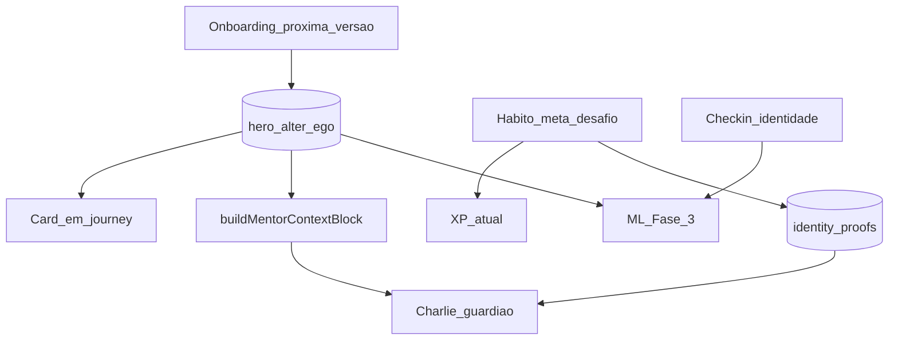

# Alter Ego — camada de identidade do Herói

Documento de planejamento: protocolo **Alter Ego Effect** (Todd Herman) como camada comportamental da V-Project, potencializando o Charlie sem virar um módulo paralelo.

**Status:** Fase 3 implementada (2026-08-11) — `identity_adherence` / `risco_identidade` no ML, mentor com Aderência + Principal risco, agente e push/Telegram de alto valor alinhados ao código (sem spam em habit_reminder). Fase 3.3 (modos/conselho/%) permanece fora do MVP.  
**Referência externa:** *The Alter Ego Effect* (Todd Herman) — identidade secreta / self-distancing / identity-based behavior.

---

## Objetivo

Fazer a V-Project evoluir de:

> hábitos + metas + XP + mentor

para:

> **Identidade → Compromisso → Ação → Prova → Reforço da identidade → Evolução**

sem descartar a gamificação atual. O XP continua. O significado psicológico muda.

Posicionamento desejado:

> “Uma jornada para se tornar quem você decidiu ser.”

---

## Análise — faz sentido nesta aplicação?

### Veredito

**Sim.** É um dos encaixes mais naturais do produto.

A V-Project já vende transformação masculina pela **Jornada do Herói**, com hábitos, metas enriquecidas, atributos, capítulos, missões, desafios, streak, check-in, ML adaptativo e o mentor **Charlie**. O Alter Ego não inventa um app novo: **dá eixo narrativo e psicológico ao loop que já existe**.

Hábitos, streaks e chatbots são copiáveis. A combinação:

`Identidade → Alter Ego → Código → Provas → Jornada → Charlie → ML adaptativo`

pode virar a lógica proprietária do produto.

### O que já existe e serve de base

| Peça atual | Como o Alter Ego aproveita |
| --- | --- |
| Onboarding (foco + metas) | Etapa “Sua próxima versão” antes/depois das metas |
| `/journey` | Card de identidade + provas da semana |
| Hábitos / metas / desafios | Ação = prova da identidade (sem nova moeda) |
| Atributos (8) | Virtudes / provas ligadas ao atributo |
| Capítulos / missões | Arco Intenção → Maestria |
| Charlie (`buildMentorContextBlock`, `MENTOR_SHARED_PROTOCOL`) | Guardião do código; bloco `IDENTIDADE DO HERÓI` |
| Memórias / objetivos / desafios do mentor | Continuidade narrativa |
| Check-in diário | Pergunta de reflexão (sem XP) |
| ML + agente + notificações | Fase 3: aderência à identidade |
| Charlie Call / despertador | Ativação matinal do alter ego |
| Loja de personalidades do Charlie | **Permanece separada** (tom do mentor ≠ identidade do herói) |

### O que NÃO fazer

1. **Não criar módulo isolado** “Alter Ego” desconectado da jornada — vira feature morta.
2. **Não confundir** personalidade do Charlie (`classico`, `militar`…) com Alter Ego do usuário.
3. **Não criar nova moeda** (pontos de identidade, moedas de ego, etc.) — só **provas** como narrativa sobre ações já recompensadas com XP.
4. **Não fazer Charlie *ser* o alter ego** — Charlie permanece Charlie; ele **protege e confronta** a identidade do herói.
5. **Não lançar arquétipos RPG cedo** (Guerreiro / Estrategista / …) — parece classe; preferir identidade **sintetizada** das respostas do usuário.
6. **Não inventar % arbitrário** de “evolução da identidade” — preferir níveis narrativos (Intenção → Maestria).
7. **Não amarrar XP à autoavaliação** “agi como meu alter ego?” — incentiva mentira; serve só para reflexão + ML + Charlie.

### Separação conceitual (obrigatória)

| Conceito | Pergunta | Dono |
| --- | --- | --- |
| **Personalidade do Charlie** | Como o mentor fala comigo? | Loja `/store` → `profiles.charlie_personality` |
| **Alter Ego do Herói** | Quem eu estou tentando me tornar? | Onboarding / jornada → artefato próprio |

Exemplo coerente: Charlie **Militar** orientando o alter ego **O Executor**.

### Princípios de implementação

1. **Camada, não feature** — identidade por cima do loop Meta → Hábito → XP.
2. **Fase 1 sem ML** — primeiro persistir + injetar no Charlie + UI mínima.
3. **Uma identidade ativa** por usuário no MVP (modos/arquétipos depois).
4. **Código curto e citável** — 3–5 regras que o Charlie possa invocar.
5. **Prova ≠ XP** — mesma ação gera XP (como hoje) + eventual registro de prova.
6. **Tom respeitoso** — antigo eu = padrões a superar, não “você é fraco”.

---

## Conceito resumido (produto)

### Loop psicológico

```text
Meta → Ação → Repetição → Evidência (prova) → Identidade reforçada
```

Em vez de “Complete o hábito de treino”, o sistema (e o Charlie) fala:

> “Hoje você tem a oportunidade de provar que é o homem que decidiu se tornar.”

### Artefato Alter Ego (MVP)

Campos mínimos:

- `nome` — ex.: O Executor
- `codigo` — 3–5 princípios
- `virtudes` — características-alvo (podem mapear atributos)
- `inimigo` — padrão a superar (procrastinação, desculpas…)
- `origem` — respostas do onboarding / síntese Charlie
- `ativo` — boolean (1 ativo)

### Provas (Fase 2)

Ação concluída (hábito, desafio, meta, despertador) → XP normal **e** prova opcional:

> PROVA — Você cumpriu o compromisso mesmo sem vontade.

Acúmulo semanal / histórico; relatório noturno do Charlie.

### Níveis narrativos de identidade (Fase 2+)

1. Intenção — “Quero mudar.”
2. Experimentação — “Estou tentando.”
3. Consistência — “Estou começando a me tornar.”
4. Identidade — “Isso faz parte de quem sou.”
5. Maestria — “Não preciso mais pensar para agir.”

### Ativação contextual (Fase 2+)

Gatilhos leves (não UI barroca):

- Modo execução (iniciar hábito / treino)
- Modo foco
- Ritual matinal (Charlie Call)

---

## Arquitetura proposta (encaixe técnico)



### Pontos de código existentes

| Área | Caminho |
| --- | --- |
| Contexto do mentor | `src/mentor/context.ts` → `buildMentorContextBlock` |
| Protocolo compartilhado | `src/mentor/personalities.seed.ts` → `MENTOR_SHARED_PROTOCOL` |
| Chat / presença | `src/mentor/functions.ts` |
| Prompt por usuário | `src/mentor/prompt.server.ts` |
| Metas no contexto | `src/lib/mentor-goals.ts` |
| Onboarding | `src/routes/_authenticated/onboarding.tsx` |
| Jornada | `src/routes/_authenticated/journey.tsx` |
| Check-in | componentes / journey atuais |
| Personalidades Charlie | `/store`, `profiles.charlie_personality` |

---

## Plano de ação (to-do)

### Fase 0 — Decisão e escopo

- [x] Confirmar posicionamento: camada de identidade (não módulo isolado)
- [x] Confirmar separação: personalidade Charlie ≠ Alter Ego do herói
- [x] Confirmar: sem nova moeda; provas só na Fase 2
- [x] Confirmar: 1 alter ego ativo no MVP (sem arquétipos RPG no lançamento)
- [x] Atualizar menção em `plans/ResumoAplicacao.md` quando a Fase 1 começar (link para este doc)

### Fase 1 — Identidade (baixo risco, alto impacto)

**Critério de pronto:** usuário cria/edita alter ego; card aparece na jornada; Charlie recebe e usa o bloco de identidade nas respostas. ✅

#### 1.1 Schema e API

- [x] Migration `hero_alter_ego` (ou campos em `profiles` se preferir MVP mínimo)
  - [x] `user_id`, `nome`, `codigo` (text/json), `virtudes`, `inimigo`, `resumo`, `source_answers` (json), `active`, timestamps
  - [x] RLS: usuário lê/escreve só o próprio; `dashi` leitura admin se necessário
- [x] Server functions: `getHeroAlterEgo`, `upsertHeroAlterEgo`, `regenerateHeroAlterEgo` (opcional)
- [x] Tipos em `src/integrations/supabase/types.ts` (regen ou patch)

#### 1.2 Onboarding — “Sua próxima versão”

- [x] Etapa após metas/foco (sem criar hábitos automaticamente; sem quebrar fluxo atual)
- [x] Perguntas curtas (máx. 5):
  - [x] Característica a desenvolver
  - [x] O que mais impede
  - [x] Como quer ser reconhecido / versão em 1 ano (texto curto)
- [x] Síntese via Charlie/LLM → nome + código + virtudes + inimigo (com fallback template se LLM falhar)
- [x] Tela de confirmação: usuário pode editar nome/código antes de salvar
- [x] Usuários já onboardados: CTA em `/journey` ou `/profile` “Criar sua identidade” (não bloquear app)

#### 1.3 Charlie — guardião

- [x] Estender `MentorContextInput` + `buildMentorContextBlock` com bloco:

```text
IDENTIDADE DO HERÓI
Alter Ego: …
Código:
- …
Virtudes: …
Inimigo principal: …
```

- [x] Regra em `MENTOR_SHARED_PROTOCOL` (e/ou prompt clássico):
  - [x] Charlie permanece Charlie (não vira o alter ego)
  - [x] Em fricção (procrastinação, skip, “deixo pra amanhã”), citar o código
  - [x] Tom: confrontar com respeito; não humilhar o “antigo eu”
- [x] Incluir identidade no snapshot usado por presença (morning/evening/return) quando fizer sentido
- [x] Teste unitário do bloco de contexto (padrão dos testes de mentor/ML)

#### 1.4 UI mínima

- [x] Card em `/journey`: nome, trecho do código, link “Ver identidade”
- [x] Tela `/identity` (ou seção em `/profile`): ver/editar alter ego + regenerar (rate limit)
- [x] Copy alinhada ao visual cyberpunk existente (sem cards excessivos; uma composição clara)

#### 1.5 Metas / hábitos (significado leve)

- [x] Campo opcional ou associação conceitual meta ↔ identidade (pode ser só copy na UI na Fase 1)
- [x] Ao concluir hábito/meta: mensagem de reforço (“prova de identidade”) **sem persistir prova ainda** (só copy) — OU adiar copy até Fase 2 se preferir zero ruído

### Fase 2 — Provas e ritual

**Critério de pronto:** ações geram provas persistidas; histórico/semana visível; Charlie fecha o dia com relatório de identidade; check-in pergunta sem dar XP. ✅

#### 2.1 Provas

- [x] Tabela `identity_proofs` (user_id, source_type, source_id, atributo?, label, created_at)
- [x] Emitir prova em: hábito concluído, desafio Charlie, meta conquistada, (opcional) Charlie Call “levantei”
- [x] Não duplicar prova no mesmo source no mesmo dia (idempotência)
- [x] Contadores: provas da semana / total — no card da jornada

#### 2.2 Check-in e relatório

- [x] Pergunta no check-in: “Hoje você agiu como o homem que está tentando se tornar?” (Sim / Parcialmente / Não)
  - [x] **Sem XP / sem streak** ligado à resposta
- [x] Presença `evening` do Charlie: relatório curto (compromissos, provas, falha sem destruição de identidade)
- [x] Memória opcional de alta importância quando houver padrão (ex.: 3 dias “Não”)

#### 2.3 Narrativa e conquistas

- [x] Mapear capítulos atuais ↔ arco Intenção → Maestria (copy; sem quebrar `capitulo_atual`)
- [x] 1–2 conquistas ligadas a provas (ex.: 7 provas na semana, 30 provas totais)
- [x] Histórico simples em `/identity` (lista recente de provas)

#### 2.4 Ativação (opcional nesta fase)

- [ ] Overlay/copy leve ao iniciar treino validado ou hábito importante (“Alter ego ativado”)
- [ ] Charlie Call: script matinal referenciando código (se nativo já estiver estável)

### Fase 3 — Identidade adaptativa

**Critério de pronto:** ML/agente/notificações usam aderência à identidade; Charlie deixa de falar genérico e passa a falar do código + risco comportamental.

#### 3.1 Features / scores

- [x] Features: taxa de cumprimento vs. código, provas/semana, check-in de identidade, skips no atributo do “inimigo”
- [x] Score ou sinal `identity_adherence` (heuristic primeiro; shadow sklearn depois se útil)
- [x] Injetar no bloco do mentor: `Aderência recente` + `Principal risco`

#### 3.2 Agente e notificações

- [x] Iniciativas do agente alinhadas ao inimigo/código (não só hábitos genéricos)
- [x] Push/Telegram: copy de identidade em eventos de alto valor (streak risk, desafio, manhã)
- [x] Guardrails: não spammar identidade em todo hábito trivial

#### 3.3 Evolução avançada (depois do MVP maduro)

- [ ] Avaliar “modos” / arquétipos secundários desbloqueáveis (só se Fase 1–2 estiverem sólidas)
- [ ] Conselho do Alter Ego (“o que seu alter ego faria?”) como ritual premium/opcional
- [ ] Níveis narrativos de identidade derivados de provas + consistência (sem %)

---

## Ordem de execução (checklist mestre)

1. [x] **Fase 0** — fechar escopo e não-objetivos
2. [x] **Fase 1.1** — schema + server functions
3. [x] **Fase 1.3** — contexto + protocolo Charlie (pode paralelizar com 1.2)
4. [x] **Fase 1.2** — onboarding + síntese
5. [x] **Fase 1.4** — UI jornada / identity
6. [x] **Fase 1.5** — copy leve em metas/hábitos
7. [x] **Fase 2** — provas + check-in + relatório
8. [x] **Fase 3** — ML / agente / notificações (3.3 avançado permanece aberto)

### Entrega Fase 1 (referência rápida)

| Peça | Onde |
| --- | --- |
| Migration | `supabase/migrations/20260811120000_hero_alter_ego.sql` (aplicada no remoto) |
| Lib + API | `src/lib/alter-ego.ts`, `src/lib/alter-ego.functions.ts` |
| Testes | `src/lib/alter-ego.test.ts` |
| Charlie | `src/mentor/context.ts`, `personalities.seed.ts`, `functions.ts` |
| Onboarding | `src/routes/_authenticated/onboarding.tsx` (passo 3/4) |
| UI | `/identity`, `AlterEgoJourneyCard` em `/journey`, link no `/profile` |

### Entrega Fase 2 (referência rápida)

| Peça | Onde |
| --- | --- |
| Migration | `supabase/migrations/20260811140000_identity_proofs.sql` (aplicada no remoto) |
| Provas | `src/lib/identity-proofs.ts` — emit em hábito/meta/desafio |
| Check-in | `user_checkins.identidade_hoje` + `CheckinCard` |
| Charlie evening | `presenceUserPrompt` + bloco `PROVAS DE IDENTIDADE` |
| Conquistas | `provas_7_semana`, `provas_30` |
| UI | contadores na jornada + histórico em `/identity` |

### Entrega Fase 3 (referência rápida)

| Peça | Onde |
| --- | --- |
| Heurística | `src/lib/ml/identity-adherence.ts` + testes |
| Scores | `identity_adherence` / `risco_identidade` em `explicacao` via `recompute.ts` |
| Mentor | `formatMlSignalsForMentor` + protocolo SINAIS ML + presença morning/evening |
| Agente | `agent.ts` / `agent-jobs.ts` — copy de código/inimigo |
| Notificações | `jobs.ts` streak_risk + `mentor_challenge`; Telegram voice; **sem** identity em habit_reminder |

---

## Fora de escopo (por enquanto)

- [ ] ~~Nova moeda / pontos de identidade~~
- [ ] ~~Charlie falando *como* o alter ego do usuário~~
- [ ] ~~Trocar XP/níveis/atributos pelo sistema de provas~~
- [ ] ~~Arquétipos RPG no onboarding do MVP~~
- [ ] ~~Porcentagem “18% mais próximo da identidade”~~
- [ ] ~~Múltiplos alter egos ativos~~
- [ ] ~~Redesenhar capítulos do zero~~

---

## Riscos e mitigações

| Risco | Mitigação |
| --- | --- |
| Confusão com loja do Charlie | Copy explícita; telas e campos separados |
| Charlie genérico demais | Bloco de contexto + regras de fricção no protocolo |
| Over-gamification | Sem moeda nova; provas só Fase 2 |
| Onboarding longo | Máx. 5 perguntas; skip/CTA posterior para contas antigas |
| Tom acusatório | Protocolo: superar padrões, não humilhar |
| Escopo infinito | Travar Fase 1 antes de provas/ML |

---

## Decisão de produto (resumo)

| Pergunta | Resposta |
| --- | --- |
| Implementar? | **Sim** — como camada central, em fases |
| Começar por? | **Fase 1** (artefato + Charlie + jornada) |
| Charlie vira o alter ego? | **Não** — vira guardião |
| Nova economia? | **Não** — XP intacto; provas depois |
| Diferenciação? | Identidade + código + provas + jornada + Charlie |

**Próximo passo:** opcional Fase 3.3 (modos / conselho / níveis narrativos) ou polish de ativação (2.4).
